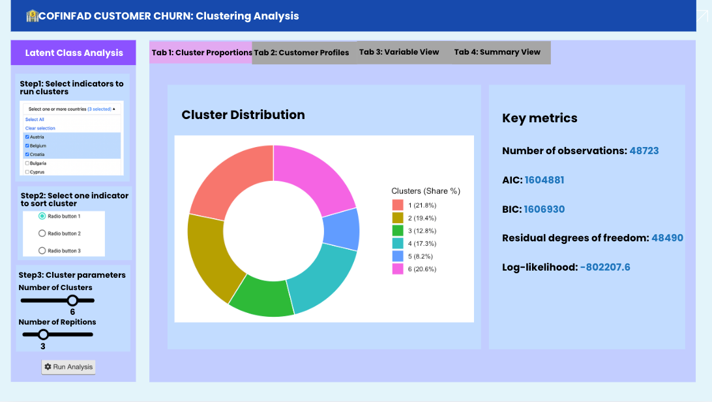
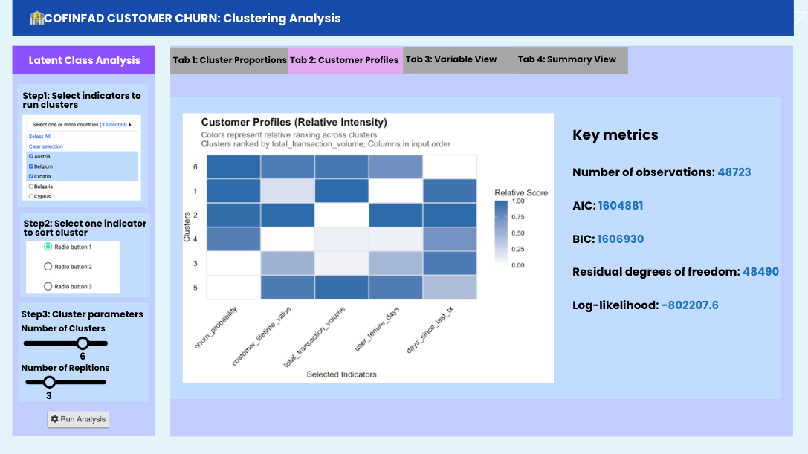
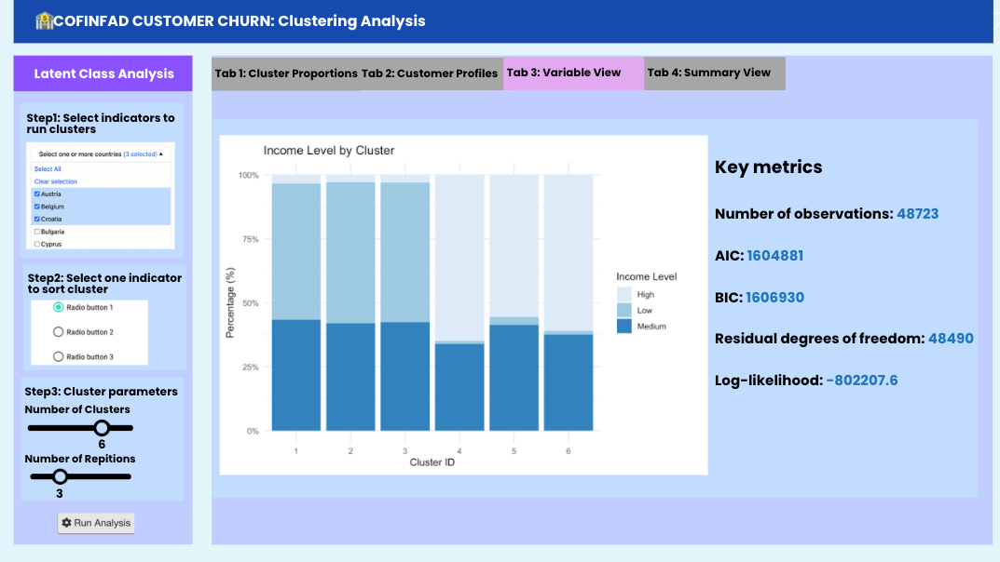
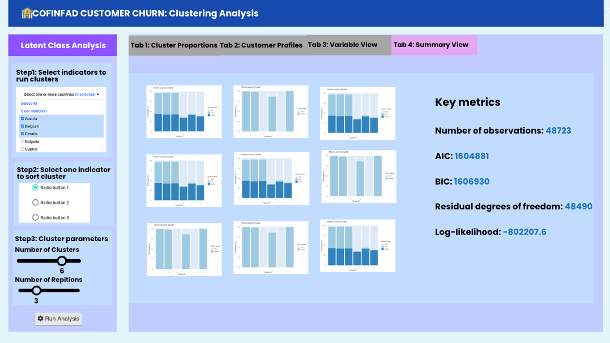

# Overview

## Introduction to Prototyping Module for Visual Analytics Shiny Application

Our project dives into the Latin American fintech to understand what drives customer behavior.

In this prototype, I'm using Latent Class Analysis (LCA) to group customers into meaningful personas based on customer behaviors. Users should be able to actively interact with the clustering model, like select their interested indicators or adjust the number of cluster groups to see how the customer segments shift. The goal is to let analysts explore their own assumptions about which customers are most loyal, valuable and which ones are on the verge of leaving the platform.

## The Dataset

We’re using the COFINFAD dataset, which covers 48,723 customers from a major Colombian fintech firm. What makes this data special is that it combines information from different dimensions:

-   Demographics: Basic profiles like age, income, and location.
-   Product Usage: Which services they use, such as credit cards, loans, or insurance.
-   Digital Engagement: How often they log in and which app features they use.
-   Attitudinal Data: Rare metrics like NPS and satisfaction scores.

By using the customer_data.csv file, we have access to 57 variables per user. This allows our clustering model to look at a customer's entire digital and financial footprint, helping us distinguish between different groups, like "power users" versus "casual spenders".

# Getting Started

## Setting the Analytical Tools for Data Wrangling

We load the R packages using the `pacman::p_load()` function:

```{r}
pacman::p_load(haven, tidyverse, 
               janitor, reshape2,
               DT, kableExtra, lubridate, poLCA)
```

## Data Wrangling

### Data Source

The dataset used in the exercise is behavioral and transactional data retrieved from 48,723 customers of a Colombian fintech company, collected over 12 months from January 4, 2023, to December 29, 2023. The data is from [COFINFAD: Colombian Fintech Financial Analytics Dataset](https://data.mendeley.com/datasets/mhb4zn3258/1)

For this project, we are specifically using the `customer_data.csv` file, which aggregates 54 variables into a single record per user that's proper for LCA clustering. The raw `transactions_data.csv` (transaction level logs) will not be used.

### Import Data

First, we import `customer_data.csv` dataset as `customer_raw_data`.

```{r}
customer_raw_data <- read_csv("data/customer_data.csv",show_col_types = FALSE)
```

### Summary of Data

Checking the data structure in the Environment, the `customer_raw_data` has 48723 rows of 54 variables in different data types.

### Check Missing Values

We first need to check the missing values as poLCA is sensitive to missing values. By checking the missing values we can decide whether to use the data or just drop it.

```{r}
library(tidyverse)

# Calculate count and percentage of NA values for each column
missing_summary <- customer_raw_data %>%
  summarise(across(everything(), ~ sum(is.na(.)))) %>%
  pivot_longer(everything(), names_to = "variable", values_to = "missing_count") %>%
  mutate(missing_percentage = (missing_count / nrow(customer_raw_data)) * 100) %>%
  arrange(desc(missing_count))

# Display variables with missing values
print(missing_summary)
```

As shown in result, `complaint_topics`, `credit_utilization_ratio` and `feature_requests` have quite high missing_percentage of 50%, 37.5% and 33.1%, we will remove these three variables together with `customer_id` which doesn't help in clustering to ensure the stability and reliability of our analysis.

```{r}
df_filtered <- customer_raw_data %>%
  dplyr::select(
    # Exclude variables with high missing_percentage
    -complaint_topics, 
    -credit_utilization_ratio, 
    -feature_requests,
    # Exclude identifiers that don't help in clustering
    -customer_id, 
    everything() 
  )

```

### Narrow Down Variables

In this step, we narrow down our dataset to the most relevant variables for clustering. Inspired by the RFM (Recency, Frequency, Monetary) framework, we transform raw date columns into meaningful behavioral metrics to enhance the model's interpretability:

-   Tenure (Loyalty): Created `user_tenure_days` (last vs. first transaction) to measure relationship length.
-   Recency (Activity): Created `days_since_last_tx` to separate active users from churned ones.

Key Filters Applied:

-   Reduce Noise: Dropped `location` and granular demographics like `marital_status` or `occupation` to keep the model focused on financial behavior.
-   Eliminate Redundancy: Removed values such as `tx_count` and `avg_tx_value` to prevent multicollinearity, keeping `total_transaction_volume` to capture historical contribution, `customer_lifetime_value` to account for future profitability, `transaction_frequency` as a measure of user engagement.
-   Consolidate Sentiment: Used `satisfaction_score` and `nps_score` as primary metrics, dropping detailed sub-scores like `app_store_rating`.
-   Avoid Bias: Removed `customer_tenure` and other pre-existing predictions to ensure our LCA model discovers unbiased patterns.

```{r}
library(lubridate) # Used for date manipulation

# Assume the study cutoff date as the final day of the dataset (2023-12-29)
study_cutoff_date <- as.Date("2023-12-29")

df_engineered <- df_filtered %>%
  # Convert raw character strings into Date objects (format: DD/MM/YYYY)
  mutate(across(c(first_tx, last_tx, last_transaction_date), 
                ~ as.Date(., format = "%d/%m/%Y"))) %>%
  
  # Calculate User Tenure (Loyalty)
  mutate(user_tenure_days = as.numeric(last_tx - first_tx)) %>%
  
  # Calculate Recency (Activity)
  mutate(days_since_last_tx = as.numeric(study_cutoff_date - last_transaction_date)) %>%
  
  # Select final variables and drop redundant columns
  dplyr::select(
    -marital_status, -occupation, -gender, -location, -average_transaction_value, -first_tx, -last_tx, -last_transaction_date, -first_transaction_date, -last_survey_date, -avg_daily_transactions, -total_tx_volume, -avg_tx_value, -tx_count, -monthly_transaction_count, -base_satisfaction, -tx_satisfaction, -product_satisfaction, -app_store_rating, -customer_tenure, -resolved_tickets_ratio, -support_tickets_count, -failed_transactions,  -weekend_transaction_ratio, -complaint_topics, -credit_utilization_ratio, -feature_requests, -customer_id, -app_logins_frequency, -nps_score, -feedback_sentiment
           
  )

# Verify the updated list of variables
colnames(df_engineered)

```

### Check Data Types

We first need to evaluate the selected variables to understand their current formats and value ranges. This assessment ensures that our transformation logic accurately aligns with the data distribution and business context.

```{r}
library(tidyverse)

# define the final 27 selected variables for cluster analysis
selected_vars <- c(
  "age", "income_bracket", "education_level", "household_size",
  "acquisition_channel", "customer_segment", "savings_account", "credit_card",
  "personal_loan", "investment_account", "insurance_product", "active_products",
  "feature_usage_diversity", "bill_payment_user", "auto_savings_enabled",
  "international_transactions", "satisfaction_score", "churn_probability",
  "clv_segment", "total_transaction_volume", "transaction_frequency", "preferred_transaction_type",
  "customer_lifetime_value", "user_tenure_days", "days_since_last_tx"
)

# display data types, sample values, value range, unique count
df_inspection <- df_engineered %>%
  dplyr::select(all_of(selected_vars)) %>%
  map_df(~ tibble(
    Data_Type = class(.x)[1],
    Sample_Values = paste(head(unique(na.omit(.x)), 3), collapse = ", "),
    Min = if(is.numeric(.x)) as.character(min(.x, na.omit = TRUE)) else "-",
    Max = if(is.numeric(.x)) as.character(max(.x, na.omit = TRUE)) else "-",
    Unique_Count = n_distinct(.x)
  ), .id = "Variable")


print(df_inspection, n = Inf)
```

### Convert Data Types

To prepare for poLCA cluster analysis, the raw data was restructured into a categorical format optimized for behavioral segmentation. Also all features were coerced into positive integers ($1, 2, 3...$) then transferred to factors, and rows with missing values were removed, to meet the strict requirements of the poLCA algorithm.

-   Custom Binning: High-variance metrics like total_transaction_volume and customer_lifetime_value were binned using fixed business thresholds (e.g., $<100M$, $100M-1B$, $>1B$) to better isolate "Whale" users from the mass market.
-   Lifecycle Tiers: Engagement variables (transaction_frequency, days_since_last_tx, user_tenure_days) were grouped into stages (e.g., Active, At Risk, Loyal) to capture user stickiness.
-   Fixed Mapping: Qualitative variables (acquisition_channel, customer_segment) were converted to factors with set levels to ensure consistent numeric encoding.

```{r}

df_labeled <- df_engineered %>%
  mutate(acquisition_channel = factor(acquisition_channel)) %>%
  mutate(acquisition_channel = recode(acquisition_channel, 
                                      "Partnership" = "Indirect", 
                                      "Referral" = "Indirect")) %>%
  
  mutate(customer_segment = recode(customer_segment,
                                   "inactive" = "Low_Use",
                                   "occasional" = "Low_Use",
                                   "regular" = "Mid_Use",
                                   "power" = "High_Use")) %>%
  
  mutate(international_transactions = ifelse(international_transactions == 0, "None", "Has_International")) %>%
  
  mutate(income_bracket = recode(income_bracket, "Very High" = "High")) %>%
  
  mutate(education_level = recode(education_level, 
                                  "Master" = "Postgrad", 
                                  "PhD" = "Postgrad")) %>%

  mutate(active_products = cut(active_products, 
                               breaks = c(0, 2, Inf), 
                               labels = c("Low_Holdings", "High_Holdings"))) %>%

  mutate(satisfaction_score = cut(satisfaction_score, 
                                  breaks = c(0, 3, 5, Inf), 
                                  labels = c("Dissatisfied", "Neutral", "Satisfied"))) %>%
  
  mutate(clv_segment = recode(clv_segment, 
                              "Bronze" = "Standard", 
                              "Silver" = "Standard", 
                              "Gold" = "High_Value", 
                              "Platinum" = "High_Value")) %>%
  mutate(clv_segment = factor(clv_segment, levels = c("Standard", "High_Value"))) %>%
  
  mutate(preferred_transaction_type = recode(preferred_transaction_type,
                                             "Deposit" = "Inflow_Eco",
                                             "Payment" = "Inflow_Eco",
                                             "Transfer" = "Outflow_Transfer",
                                             "Withdrawal" = "Outflow_Transfer")) %>%
  mutate(preferred_transaction_type = factor(preferred_transaction_type, 
                                             levels = c("Inflow_Eco", "Outflow_Transfer"))) %>%
  

  mutate(total_transaction_volume = cut(total_transaction_volume, 
                                        breaks = c(0, 100000000, 1000000000, Inf), 
                                        labels = c("Mass_Volume", "High_Volume", "Whale_Volume"),
                                        include.lowest = TRUE)) %>%
  
  mutate(customer_lifetime_value = cut(customer_lifetime_value, 
                                       breaks = c(-1, 50000000, 500000000, Inf), 
                                       labels = c("Low_CLV", "Mid_CLV", "High_CLV"))) %>%
  
  mutate(transaction_frequency = cut(transaction_frequency, 
                                     breaks = c(0, 1, 10, Inf), 
                                     labels = c("Infrequent", "Regular", "Power_User"),
                                     include.lowest = TRUE)) %>%
  
  mutate(user_tenure_days = cut(user_tenure_days, 
                                breaks = c(0, 90, 270, Inf), 
                                labels = c("New_User", "Developing", "Loyal_User"),
                                include.lowest = TRUE)) %>%
  
  mutate(days_since_last_tx = cut(days_since_last_tx, 
                                  breaks = c(-1, 7, 30, Inf), 
                                  labels = c("Active_Recent", "Warning_At_Risk", "Churned_Inactive"))) %>%
  
  mutate(churn_probability = cut(churn_probability, 
                                 breaks = c(-Inf, 0.3, 0.7, Inf), 
                                 labels = c("Safe", "Concern", "High_Risk"))) %>%

  mutate(across(c(savings_account, credit_card, personal_loan, investment_account, 
                  insurance_product, bill_payment_user, auto_savings_enabled), 
                ~ recode(as.numeric(.x), `1` = "Yes", `0` = "No"))) %>%
  
  mutate(age = cut(age, breaks = c(0, 30, 50, Inf), labels = c("Young", "MiddleAge", "Senior"))) %>%
  mutate(household_size = cut(household_size, breaks = c(0, 2, 5, Inf), labels = c("Small", "Medium", "Large"))) %>%
  
  mutate(feature_diversity = cut(feature_usage_diversity, breaks = c(-Inf, 2, 6, Inf), 
                                 labels = c("Basic", "Intermediate", "Power"))) %>%
  
  mutate(across(where(is.character), as.factor)) %>%

  # Selection and Cleaning
  dplyr::select(age, income_bracket, education_level, household_size, acquisition_channel,
                customer_segment, savings_account, credit_card, personal_loan, investment_account, 
                insurance_product, active_products, feature_diversity, 
                bill_payment_user, auto_savings_enabled, international_transactions, satisfaction_score, 
                clv_segment, total_transaction_volume, churn_probability,
                transaction_frequency, preferred_transaction_type, customer_lifetime_value, 
                user_tenure_days, days_since_last_tx) %>%
  na.omit()

df_lca_final <- df_labeled %>%
  mutate(across(everything(), ~ as.numeric(as.factor(.x))))


summary(df_lca_final)
cat("\nOriginal dataset size (Raw): ", nrow(df_engineered), "\n")
cat("Processed dataset size (LCA Final): ", nrow(df_lca_final), "\n")
```

## Cluster Analysis

### Latent Class Analysis

LCA is chosen because it is a probability-based method specifically designed for categorical data. While traditional methods like K-Means rely on physical distance between numerical points, LCA identifies hidden segments based on the likelihood of shared behavioral and demographic patterns. This makes it the most effective tool for our dataset, as it allows us to group customers into distinct, actionable categories that align with business logic.

```{r}
library(poLCA)

f <- as.formula(cbind(age, income_bracket, education_level, household_size, acquisition_channel,
                      customer_segment, savings_account, credit_card, personal_loan, 
                      investment_account, insurance_product, active_products, 
                      feature_diversity, bill_payment_user, 
                      auto_savings_enabled, international_transactions, satisfaction_score, 
                      clv_segment, total_transaction_volume, 
                      transaction_frequency, preferred_transaction_type, 
                      customer_lifetime_value, user_tenure_days, days_since_last_tx, churn_probability) ~ 1)

set.seed(1234)
LCA_6 <- poLCA(f, data = df_lca_final, nclass = 6, nrep = 5, maxiter = 5000, verbose = FALSE)

print(LCA_6)

# --- Business Label Reference ---
lapply(df_labeled, levels)
```

### Predicted cluster distribution

This section visualizes the relative size of each identified customer groups.

```{r}
library(ggplot2)
library(dplyr)
library(scales)


df_labeled$cluster <- as.factor(LCA_6$predclass)

counts <- table(df_labeled$cluster)

prop_data <- data.frame(
  ID = names(counts),
  Value = as.numeric(counts),
  stringsAsFactors = FALSE
)

prop_data$Percentage <- prop_data$Value / sum(prop_data$Value)
prop_data$Legend_Label <- paste0(
  "Cluster ", prop_data$ID, 
  " (", scales::percent(prop_data$Percentage, accuracy = 0.1), ")"
)

library(ggplot2)
ggplot(prop_data, aes(x = 2, y = Percentage, fill = ID)) +
  geom_bar(stat = "identity", width = 0.8, color = "white") +
  coord_polar(theta = "y", start = 0) +
  xlim(0.5, 2.5) + 
  scale_fill_discrete(labels = prop_data$Legend_Label) +
  theme_void() +
  theme(
    legend.position = "right",
    plot.title = element_text(hjust = 0.5, face = "bold", size = 14)
  ) +
  labs(
    title = "Cluster Distribution (Predicted)",
    fill = "Segments"
  )
```

### Assess AIC, BIC, Entropy

To ensure the statistical validity of the model, we assess key metrics AIC, BIC, and Entropy.

-   AIC & BIC (Information Criteria): These metrics evaluate the balance between model fit and complexity. Lower values generally indicate a more optimal model that explains the data well without overfitting.

-   Entropy: This measures classification precision. It indicates how distinctly the model separates individuals into clusters. Values range from 0 to 1, where higher score represents high certainty and minimal overlap between groups.

```{r}
calculate_entropy <- function(model) {
  error_prior <- -sum(model$P * log(model$P))
  
  entropy_obs <- function(p) {
    p <- p[p > 0] 
    return(-sum(p * log(p)))
  }
  error_post <- mean(apply(model$posterior, 1, entropy_obs))
  lca_entropy <- (error_prior - error_post) / error_prior
  return(lca_entropy)
}

entropy_val <- calculate_entropy(LCA_6)
cat("AIC:", LCA_6$aic, " | BIC:", LCA_6$bic, " | Entropy:", entropy_val, "\n")
```

## Customer Profile Visualization

To interpret and visualize the different classes of the LCA model, we come out with heat map and stacked bar chart to map cluster assignments against behavioral and demographic indicators.

### Feature Intensity Heatmap

The heatmap provides a visual comparison of how each cluster performs across key metrics.

-   Logic: To compare clusters, we convert categorical labels into numerical ranks and calculate the mean "level" for each group. Because these raw averages often fall into narrow ranges, subtle differences can be difficult to see on a standard scale. We apply 0-1 scaling to magnify the relative performance and highlights the difference.
-   Layout: The X-axis follows the order of selected variables (priority indicators), while the Y-axis (Clusters) is sorted by a selected metric, such as churn_probability, to create a clear value-based hierarchy.
-   Interpretation: Darker blue represents a higher concentration of "top-tier" traits, such as higher spending, longer tenure, or greater satisfaction.

```{r}
# ==============================================================================
# Heatmap 
# ==============================================================================
library(ggplot2)
library(dplyr)
library(tidyr)
library(plotly) # used for plotting charts
library(scales) # used for percentage presentation

# map the Cluster IDs back to the descriptive dataset (df_labeled)
df_labeled$cluster <- factor(LCA_6$predclass)

# select your interested indicators
# X-axis order: display order consistent with input order, with most interested ones on the left
selected_vars <- c("churn_probability", "customer_lifetime_value", 
                   "total_transaction_volume", "user_tenure_days", "days_since_last_tx")

# calculate average value, then rescale value to [0,1] to show group difference 
heatmap_data <- df_labeled %>%
  group_by(cluster) %>%
  summarise(across(all_of(selected_vars), 
                   ~ mean(as.numeric(as.factor(.x)), na.rm = TRUE))) %>%
  mutate(across(-cluster, ~ as.vector(scales::rescale(.)))) %>% # rescale
  pivot_longer(-cluster, names_to = "Variable", values_to = "Intensity")

# Y-axis order: user can select to sort classes based on most care indicator, here we take churn_probability as example
cluster_order <- heatmap_data %>%
  filter(Variable == "churn_probability") %>%
  arrange(desc(Intensity)) %>% 
  pull(cluster)

# apply heat map with selected X-axis, Y-axis order
heatmap_data <- heatmap_data %>%
  mutate(
    Variable = factor(Variable, levels = selected_vars),
    cluster = factor(cluster, levels = rev(cluster_order)) 
  )

# draw heat map
ggplot(heatmap_data, aes(x = Variable, y = cluster, fill = Intensity)) +
  geom_tile(color = "gray90", linewidth = 0.5) +
  
  scale_fill_gradient(low = "white", high = "#2C6BAA") +
  
  labs(title = "Customer Profiles (Relative Intensity)",
       subtitle = "Colors represent relative ranking across clusters\nClusters ranked by total_transaction_volume; Columns in input order",
       x = "Selected Indicators", 
       y = "Clusters",
       fill = "Relative Score") +
  
  theme_minimal() +
  theme(
    axis.text.x = element_text(angle = 45, hjust = 1, color = "black", size = 10),
    axis.text.y = element_text(color = "black", size = 10),
    panel.grid = element_blank(),
    plot.title = element_text(face = "bold", size = 14),
    plot.subtitle = element_text(size = 11, color = "gray30")
  )
```

### Segment Composition Bar Chart

To examine the internal distribution of specific variables, we used 100% stacked bar charts.

-   Logic: A custom R function generates distributions for any selected variable (e.g., NPS or Income), identifying the exact proportions of customer types within each segment.

```{r}
# ==============================================================================
# Stacked Bar Chart
# ==============================================================================
# Create a function to enable user to pass in any interested indicator to distribution among classes
plot_cluster_composition <- function(data, target_var, title_name) {
  p <- ggplot(data, aes(x = cluster, fill = !!sym(target_var))) +
    geom_bar(position = "fill") +
    scale_y_continuous(labels = percent) +
    scale_fill_brewer(palette = "Blues") +
    labs(title = paste(title_name, "by Cluster"),
         x = "Cluster ID",
         y = "Percentage (%)",
         fill = title_name) +
    theme_minimal()
  
  return(p)
}

# Example 1：check nps_score 
p_nps <- plot_cluster_composition(df_labeled, "churn_probability", "Churn Level")
print(p_nps)

# Example 2：check income_bracket 
p_income <- plot_cluster_composition(df_labeled, "income_bracket", "Income Level")
print(p_income)

# ------------------------------------------------------------------------------
# Interactive Plotly
# ------------------------------------------------------------------------------
ggplotly(p_nps)
```

## Shiny UI Design

My UI design for the Shiny Application will include one Configuration Panel and 4 Visualization Tabs (Cluster Proportions, Customer Profiles, Variable View, Summary View). 

All the UI interaction happens in the Configuration Panel. The workflow starts when users define their model parameters. Upon clicking Run Model, the system processes the Latent Class Analysis and dynamically updates the Visualization Tabs with the latest results.

**Configuration Panel:** 

- **Introduction:** This interactive interface empowers users to customize their Latent Class Analysis (LCA). You can select specific behavioral indicators, define the number of clusters and repetitions, and sort the results by key metrics to uncover clear, actionable patterns. 
- **UI Component:** Use `selectizeInput(multiple = TRUE)` for multiple indicator selection, use `sliderInput(min = 2, max = 6)` to let users define the number of clusters, use `sliderInput(min = 2, max = 5)` to let user define the number of repetitions, use `selectInput` to allow user sort cluster in defined order, use `actionButton("run_lca", "Run Analysis")` to make the model run when user have values set up.

**Cluster Proportions:** 

- **Introduction:** A donut chart was plotted to show the market share of each segment, helping us understand which group has the dominant share and which group to prioritize for resources allocation.
  
  
  
**Customer Profiles:** 

- **Introduction:** The Intensity Heatmap used in this tab provides a visual comparison of how each cluster performs across key metrics. We convert categorical labels into numerical ranks and calculate the mean "level" for each group. Because these raw averages often fall into narrow ranges, subtle differences can be difficult to see on a standard scale. We apply 0-1 scaling to magnify the relative performance and highlights the difference.
  
  
  
**Variable View & Summary View:** 

- **Introduction:** These two tabs provide segment composition bar chart, which is used to reveal the internal distribution of variables, on an overall look and on a single variable look.




